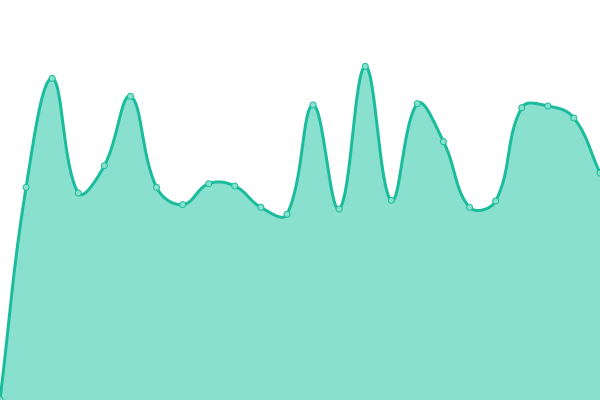

# [📈 Live Status](https://stephenmott.github.io/webmonitor): <!--live status--> **🟩 All systems operational**

This repository contains the open-source uptime monitor and status page for [Stephen Mott](http://smutils.com), powered by [Upptime](https://github.com/upptime/upptime).

With [Upptime](https://upptime.js.org), you can get your own unlimited and free uptime monitor and status page, powered entirely by a GitHub repository. We use [Issues](https://github.com/stephenmott/webmonitor/issues) as incident reports, [Actions](https://github.com/stephenmott/webmonitor/actions) as uptime monitors, and [Pages](https://stephenmott.github.io/webmonitor) for the status page.

<!--start: status pages-->
<!-- This summary is generated by Upptime (https://github.com/upptime/upptime) -->
<!-- Do not edit this manually, your changes will be overwritten -->
<!-- prettier-ignore -->
| URL | Status | History | Response Time | Uptime |
| --- | ------ | ------- | ------------- | ------ |
|  [Ingot](https://www.ingot.cloud/css/general.css) | 🟩 Up | [ingot.yml](https://github.com/stephenmott/webmonitor/commits/HEAD/history/ingot.yml) | 

 767ms
     
 | 

<a href="https://stephenmott.github.io/webmonitor/history/ingot">97.17%</a>
    

|  [Leeds](http://leeds.lambtoncc.com/index.fsscript) | 🟩 Up | [leeds.yml](https://github.com/stephenmott/webmonitor/commits/HEAD/history/leeds.yml) | 

 1400ms
     
 | 

<a href="https://stephenmott.github.io/webmonitor/history/leeds">100.00%</a>
    

|  [Etch](https://www.etch-suits.co.uk) | 🟩 Up | [etch.yml](https://github.com/stephenmott/webmonitor/commits/HEAD/history/etch.yml) | 

 602ms
     
 | 

<a href="https://stephenmott.github.io/webmonitor/history/etch">100.00%</a>
    

|  [SMUtils](https://www.smutils.com) | 🟩 Up | [sm-utils.yml](https://github.com/stephenmott/webmonitor/commits/HEAD/history/sm-utils.yml) | 

 559ms
     
 | 

<a href="https://stephenmott.github.io/webmonitor/history/sm-utils">100.00%</a>
    

|  [BISPM](https://www.bispm.co.uk) | 🟩 Up | [bispm.yml](https://github.com/stephenmott/webmonitor/commits/HEAD/history/bispm.yml) | 

 1222ms
     
 | 

<a href="https://stephenmott.github.io/webmonitor/history/bispm">100.00%</a>
    

|  [A Leash Above](https://www.aleashabove.com) | 🟩 Up | [a-leash-above.yml](https://github.com/stephenmott/webmonitor/commits/HEAD/history/a-leash-above.yml) | 

 1028ms
     
 | 

<a href="https://stephenmott.github.io/webmonitor/history/a-leash-above">100.00%</a>
    

<!--end: status pages-->

[**Visit our status website →**](https://stephenmott.github.io/webmonitor)

## 📄 License

- Powered by: [Upptime](https://github.com/upptime/upptime)
- Code: [MIT](./LICENSE) © [Anand Chowdhary](https://anandchowdhary.com), supported by [Pabio](https://pabio.com)
- Data in the `./history` directory: [Open Database License](https://opendatacommons.org/licenses/odbl/1-0/)
